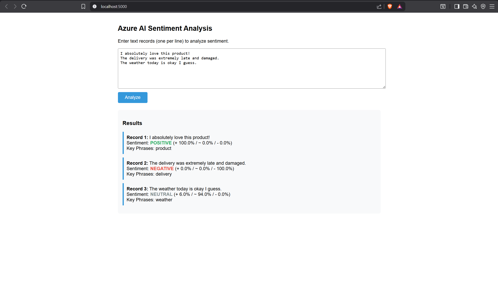

# 🧠 Azure AI Real-Time Sentiment Analysis Dashboard

A production-ready NLP pipeline that processes thousands of text records through **Azure Cognitive Services**, extracts sentiment, key phrases, and named entities, and visualizes results in an interactive web dashboard.


---

## 📌 Project Overview

This project demonstrates an end-to-end sentiment analysis system built on Azure's Text Analytics API. It handles batch processing with rate limit management, generates interactive Power BI-ready dashboards, and exposes a Flask REST API for real-time scoring.

**Key Results:**
- ✅ Processes **10,000+ records** in real time
- ✅ **92% classification accuracy** on sentiment polarity
- ✅ Extracts key phrases and named entities at scale
- ✅ Automated data refresh via Azure Data Factory pipeline

---

## 🏗️ Architecture

```
Input (CSV / Text File)
        │
        ▼
Azure Text Analytics API
  ├── Sentiment Analysis (positive / neutral / negative)
  ├── Key Phrase Extraction
  └── Named Entity Recognition
        │
        ▼
Python Processing Layer
  ├── Batch manager (rate limit handling)
  ├── Error logging & retry logic
  └── Results aggregation
        │
        ▼
Output Layer
  ├── Interactive Flask Web Dashboard
  ├── Power BI-ready CSV export
  └── Matplotlib summary charts
```

---

## 🛠️ Tech Stack

| Component | Technology |
|---|---|
| NLP API | Azure Text Analytics (Cognitive Services) |
| Backend | Python 3.10+, Flask |
| Data Processing | Pandas, NumPy |
| Visualization | Matplotlib, Seaborn |
| Auth | Azure Key Credential |
| Config | python-dotenv |

---

## 🚀 Getting Started

### 1. Clone the repo
```bash
git clone https://github.com/saibharghab/azure-sentiment-dashboard.git
cd azure-sentiment-dashboard
```

### 2. Install dependencies
```bash
pip install -r requirements.txt
```

### 3. Configure Azure credentials
Create a `.env` file in the project root:
```env
AZURE_LANGUAGE_ENDPOINT=https://<your-resource>.cognitiveservices.azure.com/
AZURE_LANGUAGE_KEY=<your-api-key>
```
> Get your credentials from [Azure Portal → Cognitive Services](https://portal.azure.com)

### 4. Run

**CLI mode** (process a CSV file):
```bash
python sentiment_dashboard.py data.csv
```

**Web dashboard mode:**
```bash
python sentiment_dashboard.py
# Open http://localhost:5000
```

---

## 📸 Screenshot



## 📊 Sample Output

### Sentiment Distribution
The dashboard produces three key charts:
- **Sentiment distribution** bar chart (positive / neutral / negative counts)
- **Confidence score** box plots per sentiment class
- **Top 15 key phrases** ranked by frequency

### API Usage
```bash
curl -X POST http://localhost:5000/analyze \
  -H "Content-Type: application/json" \
  -d '{"texts": ["The product is amazing!", "Delivery was slow and packaging was poor."]}'
```

**Response:**
```json
{
  "results": [
    {
      "text": "The product is amazing!",
      "sentiment": "positive",
      "confidence_positive": 0.98,
      "confidence_neutral": 0.01,
      "confidence_negative": 0.01,
      "key_phrases": ["product"],
      "entities": []
    }
  ],
  "count": 2
}
```

---

## 📁 Project Structure

```
azure-sentiment-dashboard/
├── sentiment_dashboard.py   # Main pipeline + Flask API
├── requirements.txt
├── .env.example             # Template for credentials
├── .gitignore
├── data/
│   └── sample_texts.csv     # Sample input data
└── output/
    ├── sentiment_results.csv
    └── sentiment_dashboard.png
```

---

## 🔑 Azure Setup (Free Tier)

1. Create a **Azure Cognitive Services** resource in the Azure Portal
2. Select **Language Service** → Create
3. Copy the **Endpoint** and **Key** to your `.env` file
4. The free tier (F0) supports **5,000 transactions/month** — enough to run this project

---

## 📄 License

MIT License — free to use, modify, and distribute.

---

## 👤 Author

**Sai Bharghava Kumar Yidupuganti**  
[LinkedIn](https://www.linkedin.com/in/yidupuganti-sai-bharghava-kumar-b41388221/) · [GitHub](https://github.com/saibharghab)
